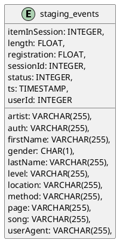
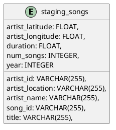
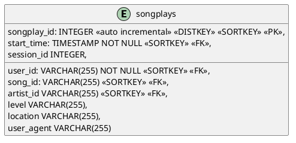
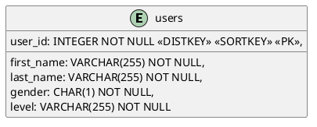
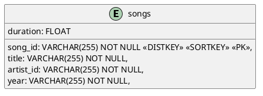
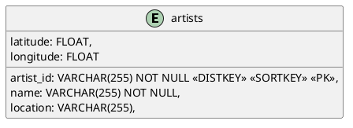
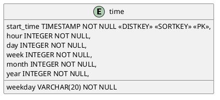
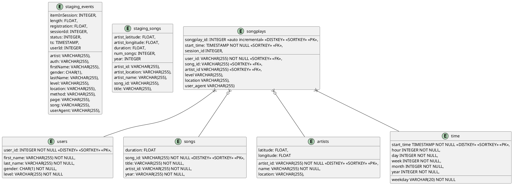

# Project 2: Udacity Sparkify Data Warehouse
### Introduction
In this project, we try to help one music streaming startup, Sparkify, to move their user base and song database processes on to the cloud. Specifically, I build an ETL pipeline that extracts their data from AWS S3 (data storage), stages tables on AWS Redshift (data warehouse with columnar storage), and execute SQL statements that create the schema database from these staging tables.
### Dataset
We will be working with 3 datasets that reside in us-west-2 S3 bucket provided by udacity. Here are the S3 buckets links for each:
- Song data: s3://udacity-dend/song_data
- Log data: s3://udacity-dend/log_data
- This third file s3://udacity-dend/log_json_path.json contains the meta information that is required by AWS to correctly load s3://udacity-dend/log_data
#### Song Dataset
The first dataset is a subset of real data from the Million Song Dataset. Each file is in JSON format and contains metadata about a song and the artist of that song. The files are partitioned by the first three letters of each song's track ID. For example, here are file paths to two files in this dataset.
```
song_data/A/B/C/TRABCEI128F424C983.json
song_data/A/A/B/TRAABJL12903CDCF1A.json
```
And below is an example of what a single song file, `TRAABJL12903CDCF1A.json`, looks like.
```json
{
  "num_songs": 1, 
  "artist_id": "ARJIE2Y1187B994AB7", 
  "artist_latitude": null, 
  "artist_longitude": null, 
  "artist_location": "", 
  "artist_name": "Line Renaud", 
  "song_id": "SOUPIRU12A6D4FA1E1", 
  "title": "Der Kleine Dompfaff", 
  "duration": 152.92036, 
  "year": 0
}
```
#### Log Dataset
The second dataset consists of log files in JSON format generated by this event simulator based on the songs in the dataset above. These simulate app activity logs from an imaginary music streaming app based on configuration settings.

The log files in the dataset you'll be working with are partitioned by year and month. For example, here are file paths to two files in this dataset.

```
log_data/2018/11/2018-11-12-events.json
log_data/2018/11/2018-11-13-events.json
```
### Schema
#### Staging tables
We have two staging tables which copy the several JSON files inside the S3 buckets.

- staging_events: the staging table which indicates the actions done by users (which song are listening, etc.. ), include the data from log data


- staging_songs: the staging table which indicates the information of songs and artists, includes the song data


#### Fact table
songplays - records in event data associated with song plays i.e. records with page NextSong


#### Dimension tables
- users - users in the app

- songs - songs in music database

- artists - artists in music database

- time - timestamps of records in songplays broken down into specific units

### Database Design

### Project Structure
- `src/create_tables.py` - This script will drop old tables (if exist) ad re-create new tables.
- `src/etl.py` - This script executes the queries that extract `JSON` data from the `S3 bucket` and ingest them to `Redshift`.
- `src/sql_queries.py` - This file contains variables with SQL statement in String formats, partitioned by `CREATE`, `DROP`, `COPY` and `INSERT` statement.
- `src/test.ipynb` - This file contains the execution of etl pipelines.
- `src/configurations/dhw.cfg` - Configuration file in configurations folder used that contains info about `Redshift` cluster, `IAM` role arn of `Redshift` cluster and `S3` bucket provided by udacity
- `src/configurations/credentials.cfg` - Configuration file in configurations folder used that contains all credentials' information (IAM user access key and secret key, redshift username and password).
- `src/configurations/redshift.cfg` - Configuration file in configurations folder used that contains all redshift configurations
- `src/configurations/aws-configurations` - This file contains the running of aws services creation and configurations.
- `src/configurations/environment.py` - This file contain the Configuration class including the necessary for ETL pipeline.
### Setups and Configurations
#### Credentials
- Create a new `IAM user` in your AWS account.
- Attach AdministratorAccess, AmazonRedshiftFullAccess and AmazonS3ReadOnlyAccess policies to the created IAM users.
- Encode the created IAM user access key and secret key to base64 string and fill it to AWS section in credentials.cfg file.
```
[AWS]
KEY=
SECRET=
```
- Create an `IAM Role` that makes `Redshift` able to access `S3 bucket` (ReadOnly)
#### Redshift cluster
##### Prerequisite condition
- Fill in all values in redshift.cfg file, the structure of this file is described below:
```
[REDSHIFT]
CLUSTER_TYPE=
NUM_NODES=
NODE_TYPE=
CLUSTER_IDENTIFIER=
DB_NAME=
PORT=
IAM_ROLE_NAME=
REGION=
```
- Fill in all values in REDSHIFT section in credentials.cfg file to indicate the redshift username and base64 encoded password.
```
[REDSHIFT]
USER=
PASSWORD=
```
##### Create Redshift cluster from code
- Follows the code cell description and run the IaS (infrastructure as code) code cell in aws-configurations.ipynb to create aws services, but do not run the cleanup section until the development or testing are finished.
- After running aws-configurations.ipynb successfully, fill the redshift IAM role ARN, redshift host, redshift dbname, redshift port and redshift region in the values in dwh.cfg:
```
[IAM]
ARN_IAM_ROLE=

[CLUSTER]
HOST=
DB_NAME=
DB_PORT=
REGION=

[S3]
LOG_DATA='s3://udacity-dend/log_data'
LOG_JSONPATH='s3://udacity-dend/log_json_path.json'
SONG_DATA='s3://udacity-dend/song_data'
```
#### Run the ETL pipelines
##### Prerequisite condition
- Loads all configurations from dwh.cfg file
- Fills all sql statements in sql_queries.py based on the database designs above
##### How to run
- Runs create_tables.py to create staging tables, fact tables and dimension tables.
- Runs etl.py to executes the queries that extract `JSON` data from the `S3 bucket` and ingest them to `Redshift`.
- Runs each code cell in test.ipynb steps by steps to verify the data.